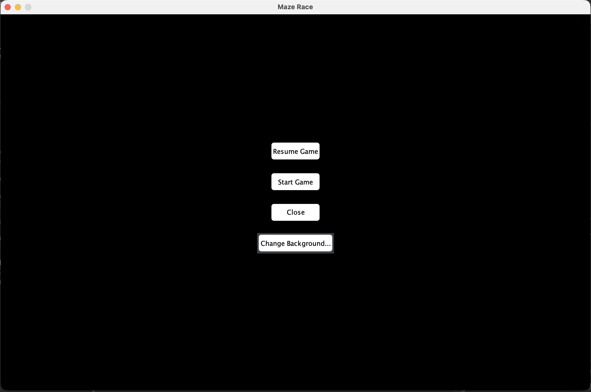
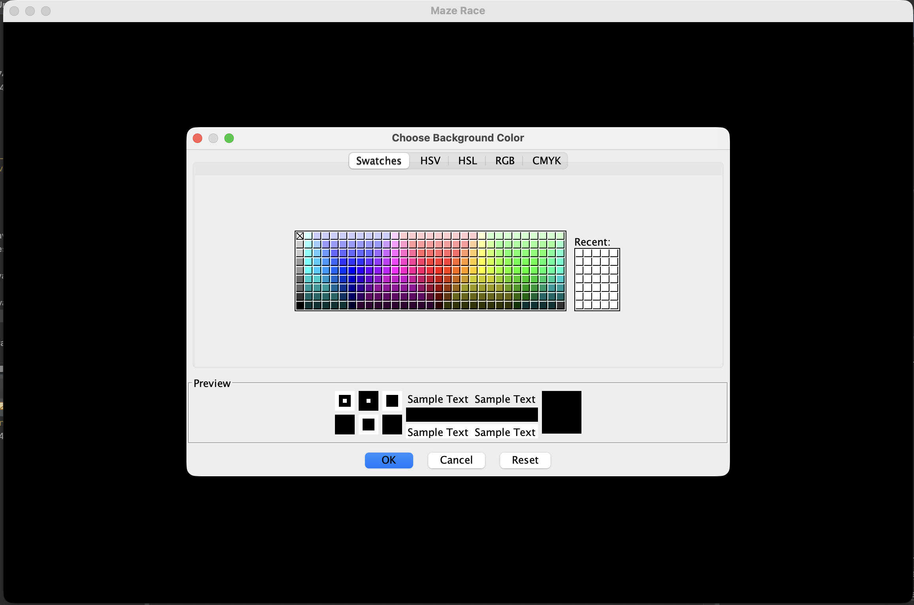
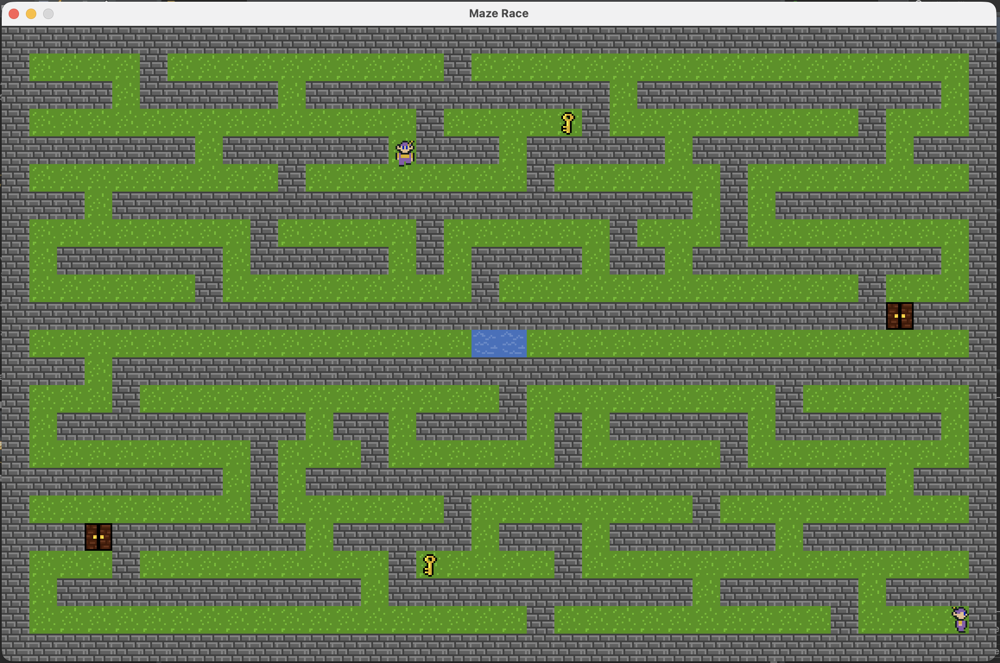

# Race in the Maze

A two-player maze racing game developed in Java using Swing.

## Features

- Two-player gameplay
- Collision detection system
- Tile-based map rendering
- Keyboard controls
- Character customization
- Object interaction (keys and fake keys)
- JUnit 5 unit testing

## Technologies Used

- Java
- Java Swing
- JUnit 5

## Screenshots

### Main Menu



### Customization



### Gameplay



## How to Run

1. Clone the repository

```bash
git clone https://github.com/S-i-m-a-o/Race_in_the_maze.git
```

2. Open the project in Eclipse

3. Run:

```text
src/main/Main.java
```

## Project Structure

```text
MazeRace
├── src
├── res
├── screenshots
├── README.md
└── .project
```

## Learning Outcomes

This project was developed as part of a university software development module and demonstrates:

- Object-Oriented Programming (OOP)
- GUI development with Swing
- Game loop implementation
- Collision detection
- Event handling
- Unit testing with JUnit 5

## Authors

- Guilherme Simão
- Bernard Fox
- Rafael Vilatore
